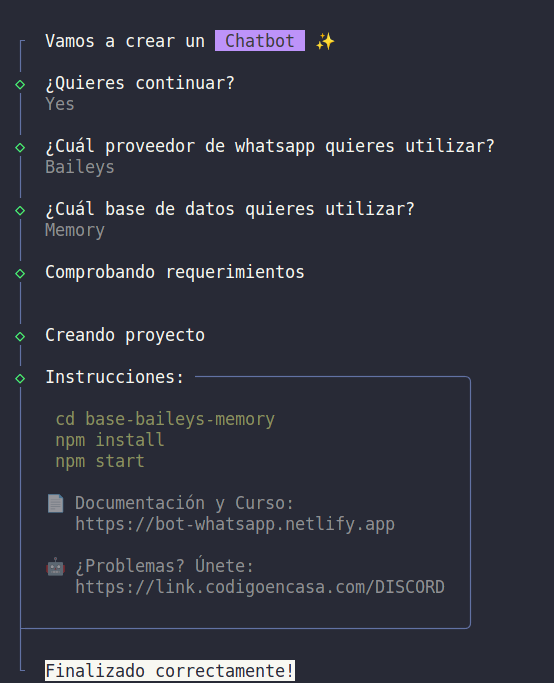

# El chatbot lawyer

# Conceptos generales del bot

> El desarrollo de la libreriá se basa en tres (3) piezas para su correcto funcionamiento:

- **Flow**: Encargado de construir todo el contexto de la conversación, finalmente su objetivo es brindar una capa amigable al desarrollo.
- **Provider**: como si de un conector se trata es el objetivo es poder camibar fácilmente de proveedor de Whatapp en minutos sin el riesgo de dañar otras partes del bot.
- **Database**: Siguiente la línea de pensamiento de conectores, de igual manera que el provider nos brinda la capacidad de poder cambiar de capa de persistencia de datos (guardar datos) sin invertir timepo en reescribir nuestro flujo.

# Empezar a usar el chatbot 

Para ello requieres utilizar herrramientas como **git** así como **node**. 

Una vez hecho eso consultaremos el comando para utilizar la libreria de WhatsApp [aquí](https://bot-whatsapp.netlify.app/)

## Pasos para mi primer flujo 

1. Ejecutamos el siguiente comando: 

2. A lo cual debemos ejecutar los siguientes:

3. Se debió crear el siguiente directorio en nuestra caperta:

4. Nos movemos a ese directorio y ejecutamos lo siguiente:

5. Aquí tendremos nuestro flujo y podremos seguir programando 
